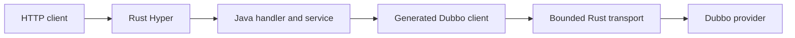

# rest-sample-dubbo-consumer

[English](README.md) | [Türkçe](README.tr.md)

A REST application that calls Dubbo providers.

- Rust Hyper accepts HTTP requests.
- Java handlers keep the business flow.
- `java-rust-dubbo` performs the lightweight Dubbo client work.
- Providers can be found by a static address or ZooKeeper.
- The sample includes GET, POST, PATCH, and DELETE flows.

Current versions: `rust-java-rest:4.3.0`, `java-rust-dubbo:0.7.1`, `rest-sample-utility:0.4.1`, `rust-sample-model:0.4.1`.

## Read This First

Choose one runtime surface before copying code. Most Kubernetes applications should start with a
static Service DNS address and the native client. Add ZooKeeper only when registry semantics are a
real requirement. Add the full consumer surface only when the application uses those contracts.

| Copy | Replace in your service |
| --- | --- |
| `@ReactorApplication` and constructor injection | Package name and application class |
| Generated `DubboClients` declaration | Your shared Dubbo interfaces and methods |
| Route workload and admission annotations | Limits measured for your provider and DB capacity |
| Readiness dependency check | Your required provider contracts |
| Static/ZooKeeper profile layout | Addresses, registry path, credentials, and Kubernetes limits |

The POM inherits `rust-java-platform-parent`. The normal surface uses the REST starter plus the
selected Dubbo profile. The smallest profile uses `rust-java-starter-dubbo`, which brings the
native-static client without the official Dubbo, Netty, ZooKeeper, or Hessian runtime. Code
generators remain build-only.

## What 0.6.1 Aligns

- `RestSampleDubboConsumerApplication` uses declarative framework startup.
- One `DubboClients` declaration generates all typed clients and shares one bounded transport.
- Handwritten client definitions and duplicate runtime-plan classes are removed.
- Handlers use constructor injection and generated route invokers.
- Existing REST URLs, Dubbo interfaces, payloads, profiles, and Java business flow are unchanged.

## Declarative Flow

| You write | Generated or managed for you | Runtime result |
| --- | --- | --- |
| Shared Dubbo interface | Typed client implementation and method plan | No dynamic proxy on the generated path |
| Client declaration | One shared bounded transport lifecycle | No client factory in each handler |
| REST handler and Java service | Constructor wiring and route invoker | Business logic remains Java |
| Startup condition | Conditional bean and route registration | Disabled surface adds no per-call branch |
| Route/RPC budgets | Admission and queue timeout | Controlled `503` instead of unbounded memory growth |



Start with the generated client. Use manual invoker wiring only for a deliberately unsupported
contract or framework development. For ready JSON passthrough, prefer the native response handle so
the provider body is not materialized as another Java `byte[]`.

## Start Here

Choose one consumer shape before reading any property.

| Need | Use |
|---|---|
| One ready-JSON catalog call and the fewest dependencies | Maven profile `native-static-consumer` |
| Catalog, customer reads, and customer commands | Default profile `full-dubbo-consumer` |
| Provider addresses come from ZooKeeper | Maven profile `zookeeper-discovery` |

Most Kubernetes services can start with static Service DNS. ZooKeeper is not required when one stable Kubernetes Service exposes the provider replicas.

## Quick Start: Static Provider

This is the simplest local flow. ZooKeeper is not used.

### 1. Start the provider

Follow the quick start in
[`rest-sample-dubbo-provider`](https://github.com/esasmer-dou/rest-sample-dubbo-provider).

The provider must listen on `127.0.0.1:20880`.

### 2. Start the consumer

Run from this repository:

```powershell
$env:GITHUB_PACKAGES_TOKEN="YOUR_TOKEN_WITH_READ_PACKAGES"

mvn -q `
  "-Dserver.port=8080" `
  "-Dsample.dubbo.discovery=static" `
  "-Dreactor.dubbo.providers=127.0.0.1:20880" `
  "-Dreactor.runtime.profile=micro-dubbo" `
  clean compile exec:java
```

### 3. Call the API

```powershell
curl.exe http://127.0.0.1:8080/app/health
curl.exe http://127.0.0.1:8080/app/ready
curl.exe http://127.0.0.1:8080/api/v1/catalog/nested
curl.exe http://127.0.0.1:8080/api/v1/catalog/items?limit=3
curl.exe http://127.0.0.1:8080/api/v1/customers/db/1
```

Create a customer:

```powershell
curl.exe -X POST http://127.0.0.1:8080/api/v1/customers `
  -H "Content-Type: application/json" `
  --data '{"requestId":"req-1001","customerNo":"CUST-9001","fullName":"Ayse Yilmaz","segment":"pilot","email":"ayse@example.com"}'
```

Change the status:

```powershell
curl.exe -X PATCH http://127.0.0.1:8080/api/v1/customers/1/status `
  -H "Content-Type: application/json" `
  --data '{"requestId":"req-1002","status":"active"}'
```

Delete the customer:

```powershell
curl.exe -X DELETE http://127.0.0.1:8080/api/v1/customers/1 `
  -H "Content-Type: application/json" `
  --data '{"requestId":"req-1003","reason":"sample cleanup"}'
```

The ready-to-import Postman collection is under
[`artifacts/postman`](artifacts/postman/rest-sample-dubbo-consumer.postman_collection.json).

## Main Endpoints

| Endpoint | Purpose |
|---|---|
| `GET /app/health` | Process liveness; does not call Dubbo |
| `GET /app/ready` | Checks required providers |
| `GET /api/v1/catalog/nested` | Ready JSON catalog response |
| `GET /api/v1/catalog/info` | Typed catalog response |
| `GET /api/v1/catalog/items?limit=3` | Typed list response |
| `GET /api/v1/customers/db/{id}` | One customer from the DB-backed provider |
| `GET /api/v1/customers/db/by-segment?...` | Filtered customer list |
| `POST /api/v1/customers` | Low-overhead JSON command |
| `POST /api/v1/customers/typed` | Typed record command |
| `PATCH /api/v1/customers/{id}/segment` | Changes customer segment |
| `PATCH /api/v1/customers/{id}/status` | Changes customer status |
| `DELETE /api/v1/customers/{id}` | Deletes a customer |

## Static Address or ZooKeeper?

### Static address

Use this when Kubernetes Service DNS already gives one stable provider address.

```properties
sample.dubbo.discovery=static
reactor.dubbo.providers=rest-sample-dubbo-provider:20880
```

Kubernetes distributes TCP connections across the provider pods behind the Service. The consumer does not need ZooKeeper for this shape.

The distribution happens when a TCP connection is opened. Requests on an existing Dubbo connection keep using the same provider pod.

### ZooKeeper

Use ZooKeeper when providers register dynamically, interfaces live in different registries, or Dubbo discovery behavior is required.

Build:

```powershell
mvn -q -Pzookeeper-discovery clean package
```

Run:

```properties
sample.dubbo.discovery=zookeeper
reactor.dubbo.registry-address=zookeeper://zookeeper-client.platform.svc.cluster.local:2181
reactor.dubbo.registry-root=dubbo
```

ZooKeeper adds client classes, threads, and memory. Use it only when it solves a real discovery requirement.

## Runtime Size

| Traffic shape | Starting values | Meaning |
|---|---|---|
| Very small service | connections `1`, workers `1`, queue `32`, max-inflight `16` | Lowest memory; overload fails fast |
| Small production service | connections `2`, workers `2`, queue `64`, max-inflight `64` | Sample defaults; more concurrent RPC work |
| Measured high traffic | `reactor.runtime.profile=balanced-dubbo` plus measured pool values | More headroom; higher process memory |

Use exact properties instead of a hidden preset:

```properties
reactor.dubbo.native-connections-per-endpoint=2
reactor.dubbo.native-async-workers=2
reactor.dubbo.native-async-queue-capacity=64
reactor.dubbo.max-inflight=64
```

These are the sample defaults. Change them only after provider, database pool, p99, `503`, and RSS
measurements show a reason. Move to `balanced-dubbo` only when the downstream capacity can use it.

Do not solve latency by increasing every queue. A larger queue uses more memory and can slow the worst requests.

## JSON and DTO Choice

| Need | Choose | Cost |
|---|---|---|
| Pass provider JSON directly to HTTP | `byte[]` plus Rust response handle | The body is not copied back into Java |
| Validate request fields in Java | Java `record` request | Clear contract; normal parsing cost |
| Make a business decision from provider fields | Typed `record` result | Hessian decode and Java object creation |
| Return a large list without inspecting it | Ready JSON bytes | Avoids a large Java object graph |

Use typed records for business logic. Use ready JSON bytes for measured pass-through endpoints.

## Configuration

The application reads configuration in this order:

1. `src/main/resources/rust-spring.properties`
2. Files passed through `reactor.config.file` or `REACTOR_CONFIG_FILE`
3. JVM `-D...` values and supported environment variables

| File | Purpose |
|---|---|
| `rust-spring.properties` | Small local defaults |
| `config/production.properties` | Production timeouts, pools, and connection limits |
| `config/advanced-tuning.properties` | Route budgets and low-level memory tuning |

Important starting properties:

| Property | Purpose |
|---|---|
| `sample.dubbo.discovery` | Selects `static` or `zookeeper` |
| `reactor.dubbo.providers` | Static provider addresses |
| `reactor.dubbo.timeout-ms` | Maximum RPC wait |
| `reactor.dubbo.max-inflight` | Total concurrent RPC limit |
| `reactor.dubbo.native-connections-per-endpoint` | TCP connections per provider address |
| `sample.command.customer-key-admission.max-concurrent-per-key` | Prevents concurrent updates to the same customer |

## Kubernetes Example

Static Service DNS:

```yaml
env:
  - name: SAMPLE_DUBBO_DISCOVERY
    value: "static"
  - name: REACTOR_DUBBO_PROVIDERS
    value: "rest-sample-dubbo-provider:20880"
  - name: REACTOR_RUNTIME_PROFILE
    value: "micro-dubbo"
  - name: REACTOR_DUBBO_NATIVE_CONNECTIONS_PER_ENDPOINT
    value: "2"
  - name: REACTOR_DUBBO_NATIVE_ASYNC_WORKERS
    value: "2"
  - name: REACTOR_DUBBO_NATIVE_ASYNC_QUEUE_CAPACITY
    value: "64"
  - name: REACTOR_DUBBO_MAX_INFLIGHT
    value: "64"
```

ZooKeeper discovery:

```yaml
env:
  - name: SAMPLE_DUBBO_DISCOVERY
    value: "zookeeper"
  - name: REACTOR_DUBBO_REGISTRY_ADDRESS
    value: "zookeeper://zookeeper-client.platform.svc.cluster.local:2181"
  - name: REACTOR_RUNTIME_PROFILE
    value: "micro-dubbo"
```

## Code Map

| File | Why it matters |
|---|---|
| `RestSampleDubboConsumerApplication.java` | Starts the application with one declarative `RestApplication.run(...)` call |
| `DubboClients.java` | Declares generated clients, startup conditions, and one shared transport lifecycle |
| `ConsumerConfiguration.java` | Creates customer-key admission only when the full surface is enabled |
| `CatalogHandler.java` | Catalog GET examples |
| `CustomerHandler.java` | Conditional GET, POST, PATCH, and DELETE examples for the full surface |
| `NativeStaticConsumerApplication.java` | Entry point for the physically smaller native-static Maven profile |
| `rust-spring.properties` | Local settings |

The normal full surface uses `@ReactorApplication`, constructor injection, generated route invokers,
and `@EnableNativeDubboClients`. It does not create clients, handlers, factories, or modules by hand.
`sample.consumer.surface=catalog-only` disables customer components once at startup. Their routes are
not registered and strict AOT route validation remains valid. The `native-static-consumer` Maven
profile goes further: customer source files and the full runtime are not packaged at all.

## Maven Package Access

GitHub Packages requires a token with `read:packages`. The token also needs access to the private shared sample repositories.

The server IDs in `~/.m2/settings.xml` must match the POM:

```xml
<servers>
  <server>
    <id>github-rust-java-rest</id>
    <username>YOUR_GITHUB_USERNAME</username>
    <password>${env.GITHUB_PACKAGES_TOKEN}</password>
  </server>
  <server>
    <id>github-java-rust-dubbo</id>
    <username>YOUR_GITHUB_USERNAME</username>
    <password>${env.GITHUB_PACKAGES_TOKEN}</password>
  </server>
  <server>
    <id>github-rest-sample-utility</id>
    <username>YOUR_GITHUB_USERNAME</username>
    <password>${env.GITHUB_PACKAGES_TOKEN}</password>
  </server>
  <server>
    <id>github-rust-sample-model</id>
    <username>YOUR_GITHUB_USERNAME</username>
    <password>${env.GITHUB_PACKAGES_TOKEN}</password>
  </server>
</servers>
```

## Common Problems

| Symptom | Check |
|---|---|
| Maven returns `401` | Token, private repo access, and all four server IDs |
| `/app/health` is `UP`, but `/app/ready` is `DOWN` | Provider address, provider process, registry, and network |
| Connection refused | Provider host, port `20880`, and container/Kubernetes DNS |
| Typed DTO class is unknown | Shared model version and Hessian allowlist |
| Requests return controlled `503` | Route or RPC limit is protecting the pod; inspect provider and DB capacity before increasing it |
| Turkish characters are broken | Send and return UTF-8 with `application/json; charset=utf-8` |

## Production Checklist

- Use the smallest Maven profile and component surface that exports the required routes.
- Prefer Kubernetes Service DNS; enable ZooKeeper only for an explicit discovery requirement.
- Keep retries at `0` for non-idempotent commands.
- Bound HTTP route admission, RPC max in-flight, timeout, queue, and connections together.
- Use native response handles only when Java does not need to inspect or transform provider JSON.
- Keep liveness local; include required provider contracts in readiness with a short timeout.
- Test provider restart, DNS endpoint change, c64/c256 mixed load, p99, `503`, RSS, and final idle.
- Never expose raw provider exception text to the HTTP client.

## Glossary

| Term | Meaning |
| --- | --- |
| Consumer | Application that calls a Dubbo provider |
| Static discovery | Provider address comes from configuration or Service DNS |
| Registry discovery | Provider addresses are watched through ZooKeeper |
| Native handle | Provider body remains in Rust; Java carries only a response id |
| Route admission | HTTP endpoint concurrency and short queue boundary |
| RPC bulkhead | Dubbo call concurrency boundary that protects the process |

## More Detail

- [Turkish user guide](docs/USER_GUIDE.tr.md)
- [Turkish PDF guide](docs/rest-sample-dubbo-consumer-user-guide.tr.pdf)
- [Docker image guide](docker/images/README.md)
- [Production settings](src/main/resources/config/production.properties)
- [Advanced tuning](src/main/resources/config/advanced-tuning.properties)
- [v0.6.1 release notes](docs/RELEASE_NOTES_v0.6.1.md)
