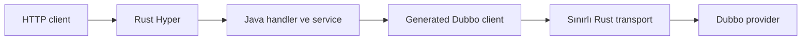

# rest-sample-dubbo-consumer

[English](README.md) | [Türkçe](README.tr.md)

Dubbo provider'larını çağıran bir REST uygulamasıdır.

- HTTP isteklerini Rust Hyper karşılar.
- İş akışı Java handler'larında kalır.
- Hafif Dubbo client işlemlerini `java-rust-dubbo` yapar.
- Provider adresi static olarak veya ZooKeeper üzerinden bulunabilir.
- GET, POST, PATCH ve DELETE örnekleri vardır.

Kullanılan sürümler: `rust-java-rest:4.4.0`, `java-rust-dubbo:0.7.2`, `rest-sample-utility:0.4.1`, `rust-sample-model:0.4.1`.

## Önce Bu Bölümü Okuyun

Kod kopyalamadan önce tek bir runtime yüzeyi seçin. Kubernetes uygulamalarının çoğu static Service
DNS ve native client ile başlamalıdır. Registry davranışı gerçek ihtiyaç değilse ZooKeeper eklemeyin.
Uygulama ilgili kontratları kullanmıyorsa full consumer yüzeyini paketlemeyin.

| Kopyalayın | Kendi servisinizde değiştirin |
| --- | --- |
| `@ReactorApplication` ve constructor injection | Package adı ve application sınıfı |
| Generated `DubboClients` tanımı | Ortak Dubbo interface ve metotlarınız |
| Route workload ve admission annotation'ları | Provider ve DB kapasitenizle ölçülen limitler |
| Readiness dependency kontrolü | Zorunlu provider kontratlarınız |
| Static/ZooKeeper profile yapısı | Adres, registry path, credential ve Kubernetes limitleri |

POM, `rust-java-platform-parent` kullanır. Normal yüzey REST starter ile seçilen Dubbo profile'ını
birleştirir. En küçük profile `rust-java-starter-dubbo` kullanır. Bu starter native-static client'ı
getirir; resmi Dubbo, Netty, ZooKeeper veya Hessian runtime'ını getirmez. Kod üreteçleri yalnız build
sırasında kullanılır.

## 0.6.2 ile Neler Hizalandı?

- `RestSampleDubboConsumerApplication` deklaratif framework başlangıcını kullanır.
- Tek `DubboClients` tanımı bütün typed client'ları üretir ve tek bounded transport paylaşır.
- Elle yazılmış client definition ve tekrar eden runtime plan sınıfları kaldırıldı.
- Handler'lar constructor injection ve generated route invoker kullanır.
- REST adresleri, Dubbo interface'leri, payload'lar, profile'lar ve Java iş akışı değişmedi.

İsteğe bağlı Glowroot mikro telemetry katmanı REST `4.4.0` ile kullanılabilir. Varsayılan olarak
kapalıdır. Açıldığında HTTP route ve native Dubbo süreleri mevcut Glowroot Central deployment'ına
gönderilir. Handler, service ve Dubbo interface kodu değişmez.

## Deklaratif Akış

| Sizin yazdığınız kod | Framework'ün ürettiği veya yönettiği alan | Runtime sonucu |
| --- | --- | --- |
| Ortak Dubbo interface | Typed client implementasyonu ve method planı | Generated yolda dynamic proxy yok |
| Client tanımı | Tek shared bounded transport lifecycle | Her handler içinde client factory yok |
| REST handler ve Java service | Constructor bağlantısı ve route invoker | Business logic Java'da kalır |
| Startup koşulu | Koşullu bean ve route kaydı | Kapalı yüzey her çağrıya branch eklemez |
| Route ve RPC bütçesi | Admission ve queue timeout | Sınırsız memory artışı yerine kontrollü `503` |



Generated client ile başlayın. Manual invoker bağlantısını yalnız bilinçli olarak desteklenmeyen bir
kontrat veya framework geliştirme işi için kullanın. Hazır JSON yalnız iletilecekse native response
handle seçin. Böylece provider body ikinci bir Java `byte[]` olarak oluşmaz.

## Buradan Başlayın

Herhangi bir property okumadan önce consumer tipini seçin.

| İhtiyaç | Seçim |
|---|---|
| Tek hazır JSON catalog çağrısı ve en az bağımlılık | Maven profile `native-static-consumer` |
| Catalog, müşteri okuma ve müşteri yazma işlemleri | Varsayılan profile `full-dubbo-consumer` |
| Provider adresleri ZooKeeper'dan gelecek | Maven profile `zookeeper-discovery` |

Birçok Kubernetes servisi static Service DNS ile başlayabilir. Tek bir Kubernetes Service provider replica'larını sunuyorsa ZooKeeper zorunlu değildir.

## Hızlı Başlangıç: Sabit Adresli Provider

Bu en basit lokal akıştır. ZooKeeper kullanılmaz.

### 1. Provider'ı başlatın

[`rest-sample-dubbo-provider`](https://github.com/esasmer-dou/rest-sample-dubbo-provider) projesindeki hızlı başlangıç adımlarını uygulayın.

Provider `127.0.0.1:20880` adresinde dinlemelidir.

### 2. Consumer'ı başlatın

Bu repo dizininde çalıştırın:

```powershell
$env:GITHUB_PACKAGES_TOKEN="READ_PACKAGES_YETKILI_TOKEN"

mvn -q `
  "-Dserver.port=8080" `
  "-Dsample.dubbo.discovery=static" `
  "-Dreactor.dubbo.providers=127.0.0.1:20880" `
  "-Dreactor.runtime.profile=micro-dubbo" `
  clean compile exec:java
```

### 3. API'yi çağırın

```powershell
curl.exe http://127.0.0.1:8080/app/health
curl.exe http://127.0.0.1:8080/app/ready
curl.exe http://127.0.0.1:8080/api/v1/catalog/nested
curl.exe http://127.0.0.1:8080/api/v1/catalog/items?limit=3
curl.exe http://127.0.0.1:8080/api/v1/customers/db/1
```

Müşteri oluşturun:

```powershell
curl.exe -X POST http://127.0.0.1:8080/api/v1/customers `
  -H "Content-Type: application/json" `
  --data '{"requestId":"req-1001","customerNo":"CUST-9001","fullName":"Ayşe Yılmaz","segment":"pilot","email":"ayse@example.com"}'
```

Müşteri durumunu değiştirin:

```powershell
curl.exe -X PATCH http://127.0.0.1:8080/api/v1/customers/1/status `
  -H "Content-Type: application/json" `
  --data '{"requestId":"req-1002","status":"active"}'
```

Müşteriyi silin:

```powershell
curl.exe -X DELETE http://127.0.0.1:8080/api/v1/customers/1 `
  -H "Content-Type: application/json" `
  --data '{"requestId":"req-1003","reason":"örnek temizlik"}'
```

Hazır Postman collection şu dizindedir:
[`artifacts/postman`](artifacts/postman/rest-sample-dubbo-consumer.postman_collection.json).

## Temel Endpoint'ler

| Endpoint | Amacı |
|---|---|
| `GET /app/health` | Uygulama çalışıyor mu? Dubbo çağrısı yapmaz |
| `GET /app/ready` | Gerekli provider'ları kontrol eder |
| `GET /api/v1/catalog/nested` | Hazır JSON catalog response'u |
| `GET /api/v1/catalog/info` | Typed catalog response'u |
| `GET /api/v1/catalog/items?limit=3` | Typed liste response'u |
| `GET /api/v1/customers/db/{id}` | DB kullanan provider'dan tek müşteri |
| `GET /api/v1/customers/db/by-segment?...` | Filtrelenmiş müşteri listesi |
| `POST /api/v1/customers` | Düşük maliyetli JSON command |
| `POST /api/v1/customers/typed` | Typed record command |
| `PATCH /api/v1/customers/{id}/segment` | Müşteri segmentini değiştirir |
| `PATCH /api/v1/customers/{id}/status` | Müşteri durumunu değiştirir |
| `DELETE /api/v1/customers/{id}` | Müşteriyi siler |

## Sabit Adres mi, ZooKeeper mı?

### Sabit adres

Kubernetes Service DNS tek bir sabit provider adresi veriyorsa bunu kullanın.

```properties
sample.dubbo.discovery=static
reactor.dubbo.providers=rest-sample-dubbo-provider:20880
```

Kubernetes, Service arkasındaki provider pod'larına TCP bağlantılarını dağıtır. Bu yapıda consumer'ın ZooKeeper kullanması gerekmez.

Dağıtım, TCP bağlantısı açılırken yapılır. Açılmış bir Dubbo bağlantısındaki istekler aynı provider pod'unu kullanmaya devam eder.

### ZooKeeper

Provider'lar dinamik kayıt oluyorsa, farklı registry'ler kullanılıyorsa veya Dubbo discovery davranışı gerekiyorsa ZooKeeper kullanın.

Build alın:

```powershell
mvn -q -Pzookeeper-discovery clean package
```

Şu ayarlarla çalıştırın:

```properties
sample.dubbo.discovery=zookeeper
reactor.dubbo.registry-address=zookeeper://zookeeper-client.platform.svc.cluster.local:2181
reactor.dubbo.registry-root=dubbo
```

ZooKeeper ek sınıf, thread ve memory kullanır. Yalnızca gerçek bir discovery ihtiyacı varsa açın.

## Çalışma Kapasitesini Seçin

| Trafik tipi | Başlangıç değerleri | Anlamı |
|---|---|---|
| Çok küçük servis | bağlantı `1`, worker `1`, kuyruk `32`, max-inflight `16` | En düşük bellek; kapasite aşılırsa hızlı hata döner |
| Küçük production servisi | bağlantı `2`, worker `2`, kuyruk `64`, max-inflight `64` | Sample varsayılanı; daha fazla eşzamanlı RPC işi |
| Ölçülmüş yüksek trafik | `reactor.runtime.profile=balanced-dubbo` ve ölçülmüş pool değerleri | Daha fazla kapasite; daha yüksek uygulama belleği |

Gizli bir preset yerine tam property değerlerini kullanın:

```properties
reactor.dubbo.native-connections-per-endpoint=2
reactor.dubbo.native-async-workers=2
reactor.dubbo.native-async-queue-capacity=64
reactor.dubbo.max-inflight=64
```

Bunlar sample varsayılanlarıdır. Provider, database pool, p99, `503` ve RSS ölçümleri gerektirmeden
değerleri artırmayın. Downstream kapasitesi doğrulanırsa `balanced-dubbo` kullanın.

Gecikme sorununu bütün queue değerlerini artırarak çözmeyin. Büyük queue daha fazla memory kullanır ve en yavaş istekleri daha da geciktirebilir.

## JSON ve DTO Seçimi

| İhtiyaç | Seçim | Maliyeti |
|---|---|---|
| Provider JSON'unu HTTP'ye doğrudan iletmek | `byte[]` ve Rust response handle | Body yeniden Java'ya kopyalanmaz |
| Request alanlarını Java'da doğrulamak | Java `record` request | Açık sözleşme; normal parse maliyeti |
| Provider alanlarıyla iş kararı vermek | Typed `record` sonuç | Hessian decode ve Java nesnesi oluşturma maliyeti |
| Büyük listeyi incelemeden döndürmek | Hazır JSON byte'ları | Büyük Java object graph oluşturmaz |

İş mantığı için typed record kullanın. Ölçülmüş pass-through endpoint'lerde hazır JSON byte'larını kullanın.

## Konfigürasyon

Uygulama ayarları şu sırayla okur:

1. `src/main/resources/rust-spring.properties`
2. `reactor.config.file` veya `REACTOR_CONFIG_FILE` ile verilen dosyalar
3. JVM `-D...` değerleri ve desteklenen environment variable'lar

| Dosya | Amacı |
|---|---|
| `rust-spring.properties` | Küçük lokal varsayılanlar |
| `config/production.properties` | Production timeout, pool ve bağlantı limitleri |
| `config/advanced-tuning.properties` | Route bütçeleri ve düşük seviye memory ayarları |

Önemli başlangıç property'leri:

| Property | Amacı |
|---|---|
| `sample.dubbo.discovery` | `static` veya `zookeeper` seçer |
| `reactor.dubbo.providers` | Static provider adreslerini verir |
| `reactor.dubbo.timeout-ms` | En uzun RPC bekleme süresidir |
| `reactor.dubbo.max-inflight` | Toplam eş zamanlı RPC limitidir |
| `reactor.dubbo.native-connections-per-endpoint` | Her provider adresi için TCP bağlantı sayısıdır |
| `sample.command.customer-key-admission.max-concurrent-per-key` | Aynı müşteriye eş zamanlı update yapılmasını engeller |

## Kubernetes Örneği

Static Service DNS:

```yaml
env:
  - name: SAMPLE_DUBBO_DISCOVERY
    value: "static"
  - name: REACTOR_DUBBO_PROVIDERS
    value: "rest-sample-dubbo-provider:20880"
  - name: REACTOR_RUNTIME_PROFILE
    value: "micro-dubbo"
  - name: REACTOR_DUBBO_NATIVE_CONNECTIONS_PER_ENDPOINT
    value: "2"
  - name: REACTOR_DUBBO_NATIVE_ASYNC_WORKERS
    value: "2"
  - name: REACTOR_DUBBO_NATIVE_ASYNC_QUEUE_CAPACITY
    value: "64"
  - name: REACTOR_DUBBO_MAX_INFLIGHT
    value: "64"
```

ZooKeeper discovery:

```yaml
env:
  - name: SAMPLE_DUBBO_DISCOVERY
    value: "zookeeper"
  - name: REACTOR_DUBBO_REGISTRY_ADDRESS
    value: "zookeeper://zookeeper-client.platform.svc.cluster.local:2181"
  - name: REACTOR_RUNTIME_PROFILE
    value: "micro-dubbo"
```

## Kod Haritası

| Dosya | Görevi |
|---|---|
| `RestSampleDubboConsumerApplication.java` | Tek bir deklaratif `RestApplication.run(...)` çağrısıyla uygulamayı başlatır |
| `DubboClients.java` | Generated client'ları, başlangıç koşullarını ve ortak transport lifecycle'ını tanımlar |
| `ConsumerConfiguration.java` | Customer-key admission bean'ini yalnız full yüzey açıkken oluşturur |
| `CatalogHandler.java` | Catalog GET örneklerini içerir |
| `CustomerHandler.java` | Full yüzey için koşullu GET, POST, PATCH ve DELETE örneklerini içerir |
| `NativeStaticConsumerApplication.java` | Fiziksel olarak daha küçük native-static Maven profile'ını başlatır |
| `rust-spring.properties` | Lokal ayarları taşır |

Normal full yüzey `@ReactorApplication`, constructor injection, generated route invoker ve
`@EnableNativeDubboClients` kullanır. Client, handler, factory veya module nesnelerini elle oluşturmaz.
`sample.consumer.surface=catalog-only`, customer component'lerini yalnız başlangıçta devre dışı bırakır.
Bu component'lerin route'ları kaydedilmez ve strict AOT route kontrolü doğru çalışır.
`native-static-consumer` Maven profile'ı daha ileri gider: customer kaynaklarını ve full runtime'ı
pakete hiç almaz.

## Maven Package Erişimi

GitHub Packages için `read:packages` yetkili token gerekir. Token'ın private ortak sample repolarına da erişimi olmalıdır.

`~/.m2/settings.xml` içindeki server kimlikleri POM ile aynı olmalıdır:

```xml
<servers>
  <server>
    <id>github-rust-java-rest</id>
    <username>GITHUB_KULLANICI_ADI</username>
    <password>${env.GITHUB_PACKAGES_TOKEN}</password>
  </server>
  <server>
    <id>github-java-rust-dubbo</id>
    <username>GITHUB_KULLANICI_ADI</username>
    <password>${env.GITHUB_PACKAGES_TOKEN}</password>
  </server>
  <server>
    <id>github-rest-sample-utility</id>
    <username>GITHUB_KULLANICI_ADI</username>
    <password>${env.GITHUB_PACKAGES_TOKEN}</password>
  </server>
  <server>
    <id>github-rust-sample-model</id>
    <username>GITHUB_KULLANICI_ADI</username>
    <password>${env.GITHUB_PACKAGES_TOKEN}</password>
  </server>
</servers>
```

## Sık Karşılaşılan Sorunlar

| Belirti | Kontrol edin |
|---|---|
| Maven `401` dönüyor | Token, private repo erişimi ve dört server kimliği |
| `/app/health` `UP`, `/app/ready` `DOWN` | Provider adresi, provider process, registry ve network |
| Connection refused | Provider host, `20880` portu ve container/Kubernetes DNS |
| Typed DTO class bilinmiyor | Ortak model sürümü ve Hessian allowlist |
| İstekler kontrollü `503` dönüyor | Route veya RPC limiti pod'u koruyor; artırmadan önce provider ve DB kapasitesine bakın |
| Türkçe karakter bozuk | UTF-8 ve `application/json; charset=utf-8` kullanın |

## Production Kontrol Listesi

- Gerekli route'ları sunan en küçük Maven profile ve component yüzeyini kullanın.
- Kubernetes Service DNS'i tercih edin. Yalnız açık bir discovery ihtiyacında ZooKeeper açın.
- İdempotent olmayan command çağrılarında retry değerini `0` tutun.
- HTTP route admission, RPC max-in-flight, timeout, queue ve connection değerlerini birlikte sınırlayın.
- Java provider JSON'unu okumayacak veya değiştirmeyecekse native response handle kullanın.
- Liveness kontrolünü lokal tutun. Zorunlu provider kontratlarını kısa timeout ile readiness'e ekleyin.
- Provider restart, DNS endpoint değişimi, c64/c256 karışık yük, p99, `503`, RSS ve final idle testi yapın.
- Provider exception metnini HTTP istemcisine olduğu gibi göstermeyin.

## Kısa Sözlük

| Terim | Basit anlamı |
| --- | --- |
| Consumer | Dubbo provider çağıran uygulama |
| Static discovery | Provider adresinin config veya Service DNS'ten gelmesi |
| Registry discovery | Provider adreslerinin ZooKeeper üzerinden izlenmesi |
| Native handle | Provider body Rust belleğinde kalırken Java'nın yalnız response kimliği taşıması |
| Route admission | HTTP endpoint eşzamanlılık ve kısa queue sınırı |
| RPC bulkhead | Process'i koruyan Dubbo çağrı eşzamanlılık sınırı |

## Ayrıntılı Bilgi

- [Türkçe kullanıcı rehberi](docs/USER_GUIDE.tr.md)
- [Türkçe PDF rehberi](docs/rest-sample-dubbo-consumer-user-guide.tr.pdf)
- [Docker image rehberi](docker/images/README.tr.md)
- [Production ayarları](src/main/resources/config/production.properties)
- [Advanced tuning ayarları](src/main/resources/config/advanced-tuning.properties)
- [v0.6.2 release notları](docs/RELEASE_NOTES_v0.6.2.tr.md)
