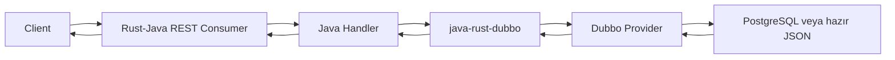

# rest-sample-dubbo-consumer Kullanıcı Rehberi

Bu rehber ilk kullanım içindir.

Amaç kısa ve nettir: Dubbo provider'daki veriyi Rust-Java REST API olarak dışarı açmak.

## İçindekiler

1. [Bu Proje Ne İşe Yarar?](#bu-proje-ne-işe-yarar)
2. [Akış Nasıl Çalışır?](#akış-nasıl-çalışır)
3. [Ne Zaman Kullanılır?](#ne-zaman-kullanılır)
4. [Hızlı Başlangıç](#hızlı-başlangıç)
5. [Endpoint'ler](#endpointler)
6. [Profile Seçimi](#profile-seçimi)
7. [ZooKeeper Mi Static Service DNS Mi?](#zookeeper-mi-static-service-dns-mi)
8. [Sık Hatalar](#sık-hatalar)

## Bu Proje Ne İşe Yarar?

`rest-sample-dubbo-consumer`, REST API açan sample uygulamadır.

REST handler Java tarafındadır. HTTP I/O Rust tarafındadır. Dubbo data path de minimum overhead için Rust tarafına yaklaştırılmıştır.

Consumer DB'ye doğrudan bağlanmaz. DB işi provider tarafındadır.

## Akış Nasıl Çalışır?



Consumer tarafı ince kalmalıdır. Ağır DB ve mutation işleri provider sorumluluğudur.

## Ne Zaman Kullanılır?

| Senaryo | Bu proje uygun mu? | Neden |
|---------|--------------------|-------|
| REST API ile Dubbo provider dışarı açılacak | Evet | Ana kullanım budur. |
| Consumer DB'ye bağlanacak | Hayır | DB connection provider'da kalmalıdır. |
| En düşük memory isteniyor | Evet | `micro-dubbo` ve static provider DNS ile kullanın. |
| ZooKeeper zorunlu | Evet | `zookeeper-discovery` profile ile çalışır. |
| Provider hazır JSON dönüyor | Evet | En verimli kullanım budur. |

## Hızlı Başlangıç

Önce provider'ı başlatın.

Sonra consumer'ı çalıştırın:

```powershell
mvn -q package
java -jar target/rest-sample-dubbo-consumer-0.1.1.jar
```

Health:

```powershell
curl http://127.0.0.1:8080/app/health
```

DB read örneği:

```powershell
curl http://127.0.0.1:8080/api/v1/customers/db
```

Customer create örneği:

```powershell
curl -X POST http://127.0.0.1:8080/api/v1/customers `
  -H "Content-Type: application/json" `
  -d "{\"requestId\":\"req-1\",\"customerNo\":\"CUST-1001\",\"fullName\":\"Ayşe Demir\",\"segment\":\"standard\",\"email\":\"ayse@example.com\"}"
```

## Endpoint'ler

| Endpoint | Amaç | Maliyet |
|----------|------|---------|
| `GET /api/v1/catalog/nested` | Provider hazır JSON döner. | En ucuz Dubbo read path. |
| `GET /api/v1/customers/db` | Provider DB'den liste okur ve JSON döner. | DB ve provider kapasitesine bağlıdır. |
| `GET /api/v1/customers/db/{id}` | Tek customer okur. | Küçük read. |
| `POST /api/v1/customers` | Customer oluşturur. | Write path, idempotency gerekir. |
| `PATCH /api/v1/customers/{id}/segment` | Segment günceller. | Aynı customer için key admission vardır. |
| `DELETE /api/v1/customers/{id}` | Customer siler. | Gerçek sistemde soft delete tercih edilebilir. |

## Profile Seçimi

| Seçim | Ne zaman? | Ayarlar |
|-------|-----------|---------|
| `micro-dubbo` | Düşük RSS, kontrollü `503` kabul. | Küçük worker, queue ve connection. |
| `micro-1x1` reçetesi | En küçük pod. | `native-connections-per-endpoint=1`, `native-async-workers=1`. |
| `micro-2x2` reçetesi | Provider boşta, p99 yüksek. | Connection ve worker `2`. |
| `balanced-stable-4x4` | Daha çok başarılı read RPS. | Connection ve worker `4`, route budget kontrollü. |

DB-backed endpoint için consumer ayarını client concurrency ile değil, provider Hikari kapasitesiyle başlatın.

## ZooKeeper Mi Static Service DNS Mi?

| Seçim | Ne sağlar? | Ne zaman kullanılır? |
|-------|------------|----------------------|
| Static Service DNS | En düşük consumer RSS. ZooKeeper client yoktur. | K8s Service zaten provider pod'larını load balance ediyorsa. |
| ZooKeeper | Provider register/re-register bilgisini takip eder. | Kurum standardı ZooKeeper ise veya registry zorunluysa. |

Static örnek:

```properties
sample.dubbo.discovery=static
reactor.dubbo.providers=rest-sample-dubbo-provider:20880
```

ZooKeeper örnek:

```properties
sample.dubbo.discovery=zookeeper
reactor.dubbo.registry-address=zookeeper://zookeeper-client.platform.svc.cluster.local:2181
```

## Sık Hatalar

| Belirti | Muhtemel neden | Çözüm |
|---------|----------------|-------|
| `503` artıyor | Route budget veya provider kapasitesi doldu. | Provider CPU, Hikari ve route metrics birlikte kontrol edilir. |
| p99 yükseliyor | Queue fazla büyüdü veya DB yavaşladı. | Queue timeout düşürün, provider DB wait ölçün. |
| Provider bulunamıyor | Static adres veya ZooKeeper config yanlış. | `reactor.dubbo.providers` veya registry adresini kontrol edin. |
| RSS yükseliyor | Full surface, typed DTO veya büyük queue kullanılıyor. | `native-static-consumer`, `micro-dubbo` ve daha küçük queue deneyin. |

